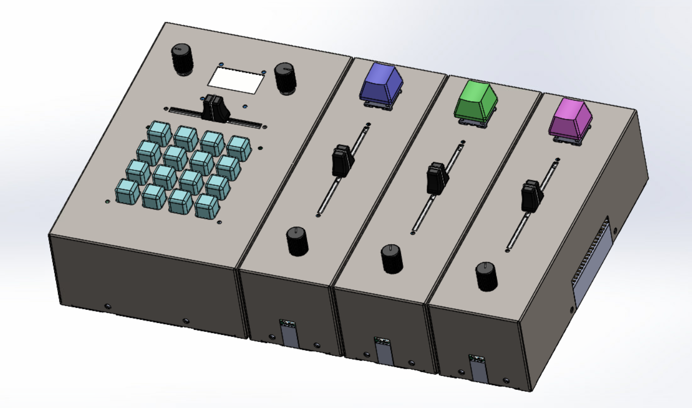

# D.R.U.M (Digital Rhythmic Utility Modules)
Files for the D.R.U.M. Machine, the modular, expandable drum machine complete with digital AND analog circuitry!




## File Structure

```
.
├── doc             # Documentation on components, throughts, h/sware details
├── module          # Files specific to the modules
│   ├── cad         # Housing design
│   ├── hardware    # PCB design (kicad)
│   └── software    # Module firmware
├── README.md       # INFO (this doc)
├── samples         # Sample to c-array conversion utils
│   └── bass-0      # Revision 0 Bass Drum samples (RAW, PCM-16)
├── sequencer       # Files specific to the sequencer
│   ├── cad         # Housing design
│   ├── hardware    # PCB design (kicad)
│   └── software    # Sequencer firmware
└── slidepot        # Slide potentiometer daughterboard
    ├── cad         # 3D models for slidepot (knob)
    └── hardware    # Daughterboard design
```


