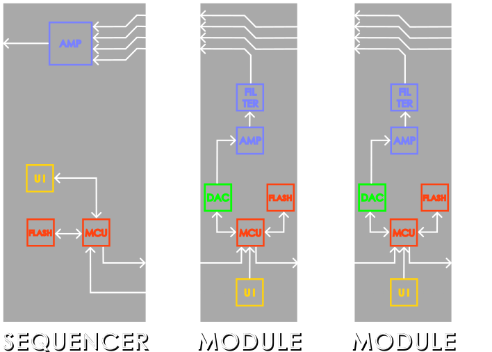
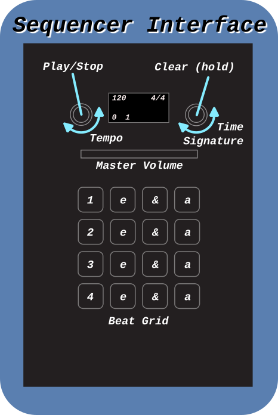

# D.R.U.M (Digital Rhythmic Utility Modules)
Files for the D.R.U.M. Machine, the modular, expandable drum machine complete with digital AND analog circuitry!


## File Structure

```
.
├── doc             # Documentation on components, thoughts, h/sware details
├── module          # Files specific to the modules
│   ├── cad         # Housing design
│   ├── hardware    # PCB design (kicad)
│   └── software    # Module firmware
├── README.md       # INFO (this doc)
├── samples         # Sample to c-array conversion utils
│   └── bass-0      # Revision 0 Bass Drum samples (RAW, PCM-16)
├── sequencer       # Files specific to the sequencer
│   ├── cad         # Housing design
│   ├── hardware    # PCB design (kicad)
│   └── software    # Sequencer firmware
└── slidepot        # Slide potentiometer daughter board
    ├── cad         # 3D models for slidepot (knob)
    └── hardware    # Daughter board design
```

## System Architecture

The D.R.U.M. system is composed of a sequencer (the base and primary controller) and between 1 and 8 "modules." The digital section of each device is based on the RP2040 microcontroller, the same device found on the Raspberry Pi Pico development board. The RP2040 was selected due to its relatively high clock speed (compared to a '328, for example), multiple cores, its PIO state machines, good documentation, and great SDK. (Oh, and it's only $1). 

The **analog section** is designed around a completely passive routing scheme, where each of the channels is simple shifted one position over each module. This allows for up to 8 modules to be connected in series before a summing module is necessary to combine the channels. Each module has a 100k pull down resistor on the lines to ensure that they are not floating. The eight lines enter the sequencer for final summation and are dc isolated via separate capacitors for each line. Although currently unused, each module also has a comparator circuit on channel 8 to detect when all the channels have been filled to signal to the RP2040 onboard that the max channel count has been reached. Each module is in charge of the amplitude that it outputs; that is, the mixing between each module is performed on a per-module basis.

The **digital section** is designed around the RP2040 microcontroller. All the modules communicate over a 32-bit SPI-like scan chain which is controlled by the sequencer. The scan chain is further documented below. The modules have the ability to send an interrupt to the sequencer when they have been "(un)selected" by the user. Only one device can be "selected" at a time. Being selected means that that module's data will be copied to the sequencer and displayed on the UI. Deselection of the module hides this information from the user but retains it within the module's memory, allowing multiple modules to have different user data. Tempo synchronization between the modules is accomplished by an interrupt line which is driven by the sequencer. This outputs a periodic pulse each "tick" (currently each beat, but in the future when microbeats are implemented, this will pulse each microbeat). The length of the tick tells the module if the beat is the start of a new measure. A short pulse (<75us) is beat 0 while a long pulse (>75us) is any other beat.

The overall routing of signals is approximated by the following diagram:




## Docs

The `doc` directory contains most of the relevant documentation to this project. This will contain information about different parts of the system, such as the serial bus protocol or the data sheets for the components used.

* [`serbus.md`](doc/serbus.md) contains information on the custom 32-bit scan chain protocol used for communication between modules. This is implemented using the RP2040's PIO state machines, meaning that the bus can be much faster than bit-banging in software. It also allows an "address-free" control scheme, where modules (bus devices) are selected by their depth on the scan chain, rather than an address. This allows a user to completely fill the bus with 8 of the same module if desired.
* [`ipc.md`](doc/ipc.md) contains information on how information is sent between the different processes running on the sequencer and the module. Both CPU cores on the RP2040 are utilized in each design to allow simultaneous execution of multiple tasks. In the case of the sequencer, the I2C bus is rather slow compared to the amount of data to be sent over it, so the second thread (core 1) handles data modification and transfer to/from the modules.

## Usage

### Power Up / Reset

Upon power up, the sequencer will run through an auto detection routine to determine how many modules are connected. It also will cycle all neo pixels in the 4x4 grid pad white to visually test that all LEDs and their individual colors are functioning properly. After this initialization sequence is performed, the sequencer will display its default config on the OLED screen.


### Programming a Beat

To start programming in a beat, the user must first select the module that they would like to program. Modules should have a button on board along with a visual indicator which can be used to select/deselect a module and identify if a module is selected. When a module is selected, the current contents of the sequencer's beat grid are saved to the previously selected module and the newly selected module's saved beat data is loaded into the grid.

Each square on the grid represents a sixteenth note (1/16) at the current tempo marking (although this may be changed in future revisions). Additionally, each square can have up to 7 different values associated with it. These values are called the *velocity* of that note. In addition to the 7 different velocities, a square can be off, giving 8 total possible states. The state of all the squares is indicated by the color of that square. Additionally, each time that a square is pressed, its new velocity value is displayed on the OLED screen to give quantitative feedback on any changes. Beats can be programmed while the sequencer is in active playback or while the system is in a stopped state.

### Playback

Playback is controlled by the tempo knob. This knob controls the tempo by rotating it; clockwise increases the tempo by one beat per minute per click of the knob and counter-clockwise decreases the tempo. Pressing the know will switch the sequencer between active playback, *sequencing*, and stopped, *idle*, states. During playback, the current square will light up white to indicate the location of the beat. This light will extinguish during the idle state.

The time signature of the playback can be changed via the time signature knob. This cycles through all built-in time signatures in a circular manner. Beats which are not available in a given time signature will be "grayed out" with a dim white square. Note that beats which had been programmed before changing the time signature but are not available in a new time signature will retain their original values but will not be played back. Holding down the time signature knob for about one second will clear the current pattern on the grid.

### Interface




