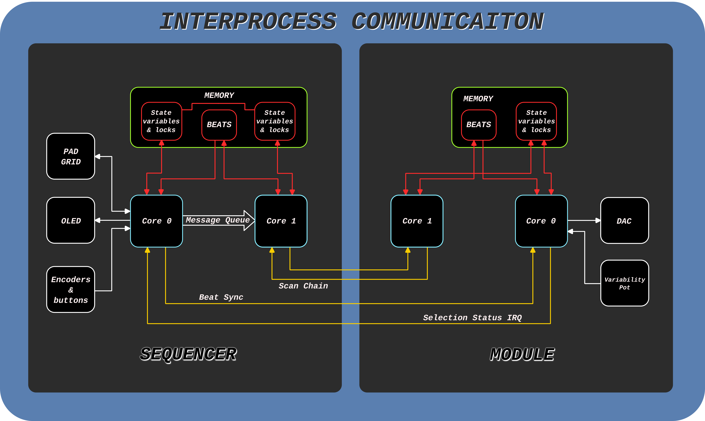

# Inter-Process Communication

Communication between the processes approximately follows the following flow diagram. Note that the PIO state machines are excluded from the diagram. They are implicitly contained "within" core 1 to allow the cores to use the scan chain.

The sequencer performs most of the tasks in the system. It is in charge of performing synchronization between the modules, handling rhythm input, handling time signature adjustments, reading from and writing data to the modules, and displaying the current system state. Since the RP2040 is a dual core device, both cores are utilized to improve response time to interrupts. Core 0 handles all user interface data as well as synchronization between modules. Due to the relatively slow speed (400k BAUD) of the I2C bus that the 4x4 keypad and OLED screen are connected to, relative to the amount of data which needs to be sent to the devices, core 0 is in use for the majority of the time. To relieve core 0 of some tasks, user inputs which change parameters of the modules, such as changing the velocity of a beat or clearing the grid, are simply put into a message queue. Core 1 then reads from this message queue and updates the sequencer’s internal data structures to reflect this change. Core 0 reads these changes on the next cycle of its event loop and updates the UI to reflect them. Both cores are synchronized through the use of mutexes (mutual exclusion tokens) and critical section entrance/exit calls. These synchronization mechanisms are included in the SDK and are both multi-thread and interrupt safe.

In addition to updating the internal data structures, core 1 also is in charge of managing the intermodule scan chain. When an event is sent into the message queue, that event’s beat data is then sent to the currently selected module. Only modified beats are sent to the module since the module’s state is copied to the sequencer upon selection. Additionally, core 1 checks to make sure that the message queue is empty before allowing a new module to be selected. This prevents pending data in the queue from being sent to the wrong module. 

Beat synchronization between the sequencer and the modules is achieved by a data line which the sequencer uses to output a low pulse at the beginning of each beat. In the future when microbeats are fully supported, this pulse will occur at the beginning of each microbeat. While not an optimal solution, the duration of the pulse is used to distinguish the beat number. A short pulse (<75us) is beat 0 while a long pulse (>75us) is any other beat on the grid. This pulse is implemented using a timer interrupt and software callback. The free running timer which generates the microbeat interrupt on core 0 contains a small section of code to detect the beginning of a beat. If the beat starts during that interrupt service routine (ISR) execution, then the synchronization line is pulled low and an alarm callback is started. The timeout of the call back is set to 25us for beat 0 and 125 us for any other beat. This gives a 50us margin on either side of the threshold for long or short beats, allowing for some delay in processing the alarm interrupt. The alarm callback restores the synchronization line to a high state. Alarms are implemented using the SDK provided functions.

The module has an interrupt registered to the pin to which the synchronization line is connected. On the falling edge, an ISR registers an alarm for 75us. When the alarm is triggered, the callback increments the beat number if the synchronization line is still low. If high, then the beat number is reset back to 0. Additionally, the callback also updates several playback variables including the beat which is currently being played back. If the new beat does not contain a note to play, the previous beat is allowed to continue playing, allowing notes to fully ring out.

When the user presses the module select button, an ISR on the module outputs a >100us negative pulse on the “open drain” line which acts as the module selection status interrupt input to the sequencer. The pulse is terminated via an alarm callback which releases the line. Since the RP2040 does not provide SDK functions to control the GPIO pins in an open drain mode, the pin is set as an input to allow the line to be pulled back high via a pull up resistor in the sequencer. To pull the line low, a logic 0 is written to the pin then the direction is switched to an output.

