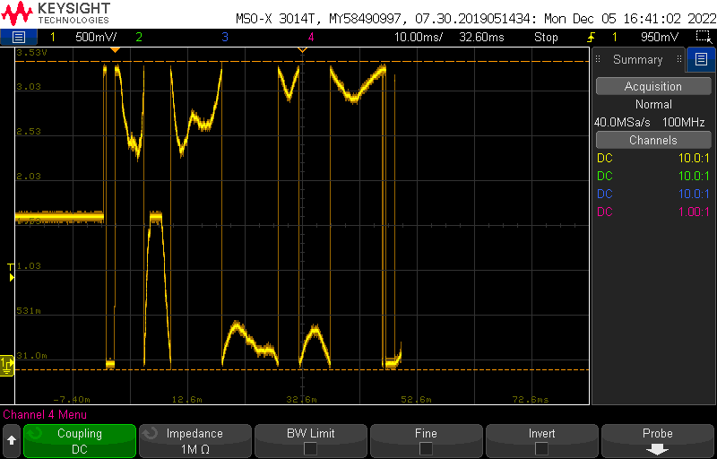
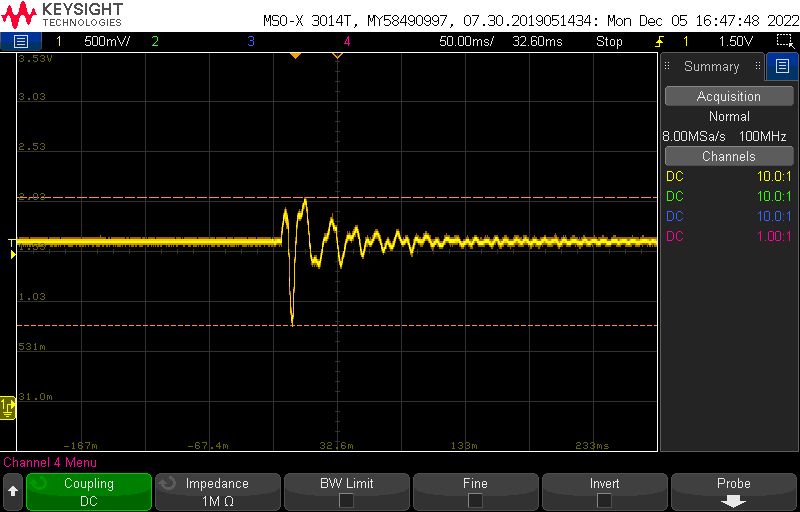

# Samples and Sample Playback

Playback of beats is accomplished by synchronizing the DAC with a 44100Hz timer interrupt. The ISR for this timer pulses the /LDAC line low for about 80ns. This causes the DAC to move the value currently in the shift register to the output conversion register. The ISR also sets a synchronization variable which tells the main event loop to shift out the next sample point of the waveform currently in playback. As mentioned below, the samples are recorded as a 16-bit signed number but the DAC uses an unsigned 16 bit number. As a result, initial sample playback resulted in a very strange waveform, as shown in the first image. The solution to this was to invert the sign of the number by adding 0x8000 to sample during playback.

The samples to be played back are stored in the off chip flash IC. At each velocity of hit, there are four different recorded samples, which allows the device to implement some variation of the sound. In total, there are 32 available samples which can be played back (although the current implementation only allows the highest 7 velocities to be played, for a total of 28 samples). These are arranged into a 2D array, where the first index is the sample and the second index is the data sample to read.

After the samples were recorded, the freely available software, Audacity, was used to convert the recordings into headerless (RAW) 16-bit signed PCM files. Each of these files was trimmed to contain the same number of samples to allow them to be easily put into the array. A python script was written to read in these files and generate the array of data which can be included as a header file in C++. In the future, the sign adjustment mentioned earlier could be performed in the python script instead of on the fly, saving a few clock cycles.

Finally, the module includes a “debug” mode which can be entered by holding down the select button during a system reset. This causes the module to output a full scale 1kHz sine wave for rudimentary signal to noise ratio and output level testing. When the button is released, the system returns to normal operation.

