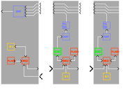
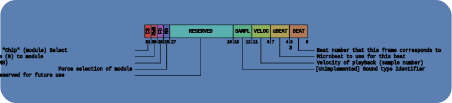

# Inter-module Serial Bus Protocol

The bus is based on a 32-bit word size. It uses three signals, much like SPI:
* `SCK` - The clock to synchronize data transfers. This only runs during transmission of data and data is sampled during the high phase of the clock.
* `DRDY` - The Data Ready is used to signal that a shift operation has completed. This signal is low during the shift and goes high during the last high clock phase of the shift. Any devices on the scan chain should not read data into their input buffers until this goes high (but they should continue to shift data through the scan chain while DRDY is low).
* `SDxx` - The Serial Data [in/out] carries the data to be transmitted, LSb first (right shift). The data out from the master changes during the low period of the clock. Data out from bus devices changes shortly after the rising edge of the clock (now after writing this out, this seems likely it might cause issues...)

## Timing

Here's the timing diagram. Note that any multiple of 32 bits can be shifted before releasing the DRDY line. This allows data to be shifted any arbitrary distance into the scan chain before the modules read and execute that word.

## Scan Chain

The scan chain is fairly straight forward. The sequencer is the 'master' of the bus and is what controls all shift operations. 

## Frame Format

The data frames are independent of the protocol for the most part, except that CS and RWB bits should always be kept as the upper two most significant bits of the word, respectively. For the DRUM modules, the word follows the following frame format:

More details:

* **CS** "Chip select" is 1 when the master wants the bus device to execute the command that is shifted in when DRDY goes high. It is 0 otherwise.
* **RWB** "Read/Write" is 1 when the master wants to perform a read operation. It is 0 to perform a write.
* **FD** "Force Deselection" is 1 when the master wants to force the bus device to deselect itself. No effect if 0. Note that this overrides the *MS* bit if *FD* is set to 1.
* **MS** "Module Select" Force selection of the bus device (module) if set to 1. No effect if 0.

## Data Transfer

### Write Operation

To perform a write operation to one or more modules, the master will set *CS*=1, *RWB*=0, and the other data fields as needed to carry the appropiate data. This can be done for as many bus devices as there are in the scan chain.

### Read Operation

To perform a write operation to one or more modules, the master will set *CS*=1, *RWB*=1, and the other data fields as needed to carry the appropiate data. The master first sends out a command word to the bus device(s) that it wants to read from. It then raises DRDY (as it would for a write operation). Since the v1.0 protocol does not make use of handshaking, the master must wait some time (currently, 100us) before performing another shift operation through the scan chain to shift the results of the read operation back into the master's RX buffer. During the wait period between command and read shifts, the bus device must execute the command and replace the contents of its shift register with the result of the read operation.

